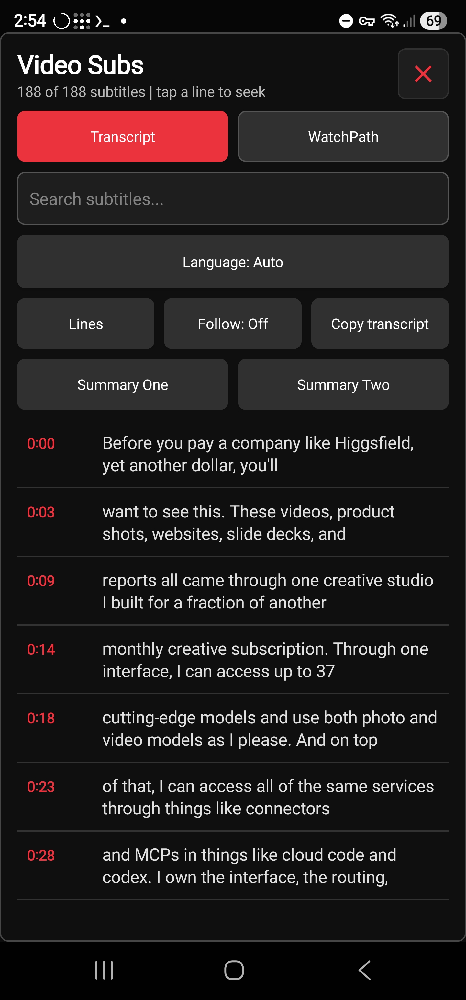
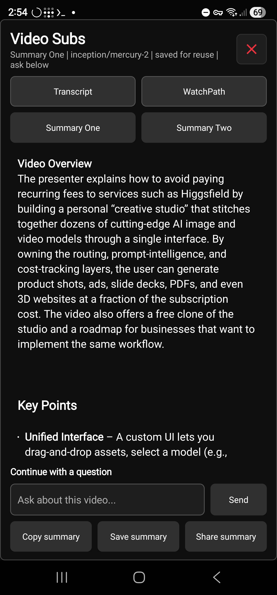
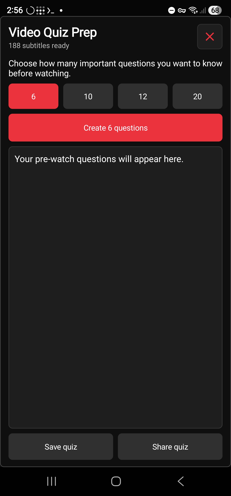
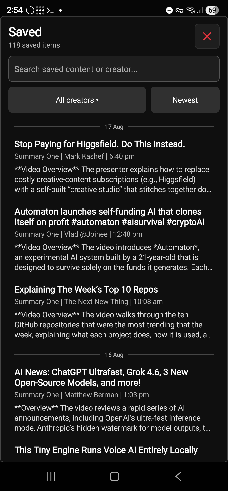
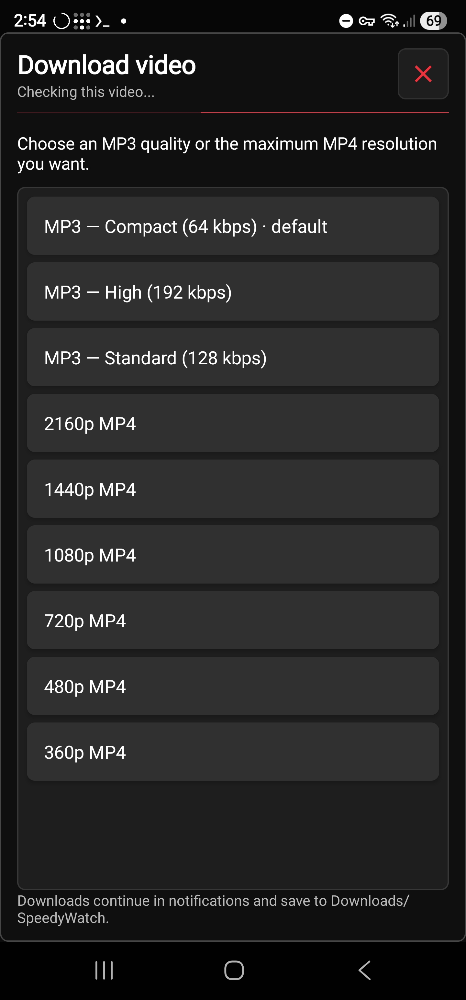
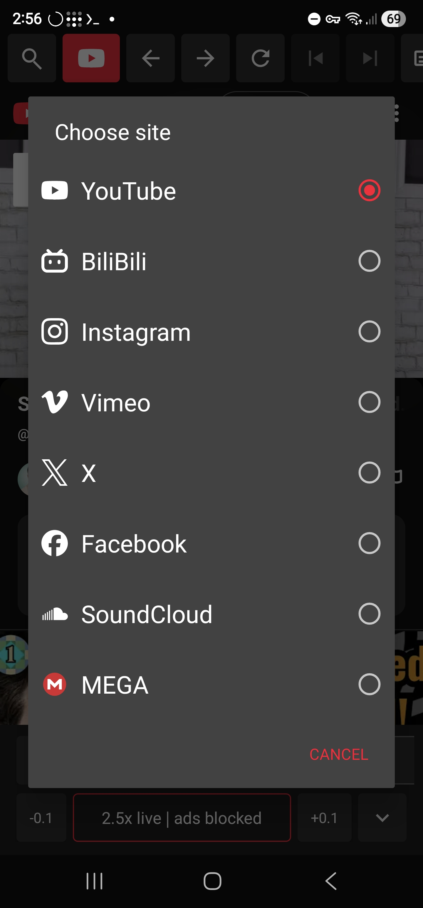
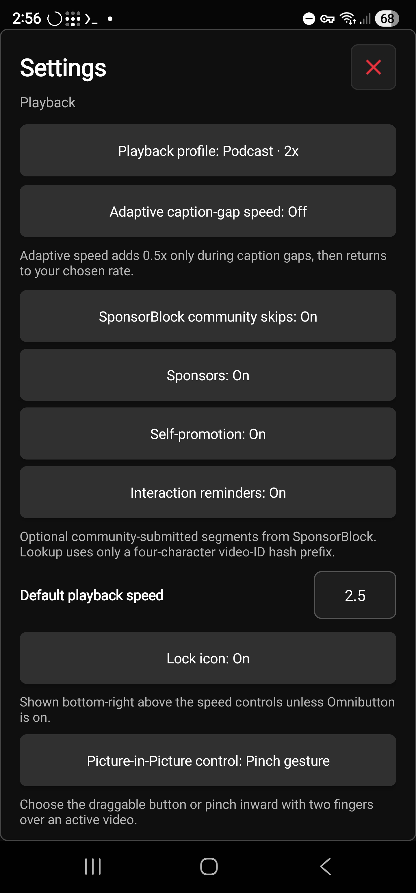

<p align="center">
  
</p>

<h1 align="center">SpeedyWatch</h1>

<p align="center">
  <strong>Watch more in less time.</strong><br><br>
  <strong>A 60-minute video should not cost you 60 minutes.</strong><br>
  SpeedyWatch helps you watch faster, search every spoken word, and turn long videos into notes, quizzes, downloads, and a watch plan built for the time you have.<br>
  <small>Installable Android APK.</small>
</p>

## Download SpeedyWatch

| Android |
| --- |
| **Android 10 and newer** |
| [**Download the installable Android APK**](https://github.com/demetre19/SpeedyWatch/releases/latest/download/SpeedyWatch.apk) |
| Current public APK: **v0.38**, debug-signed |

### Samsung Galaxy: install the APK

**Developer Options and USB debugging are not required.**

1. Download `SpeedyWatch.apk`, then open **My Files → Downloads → SpeedyWatch.apk**.
2. If Samsung says the phone cannot install unknown apps from this source, tap **Settings** in that prompt and enable **Allow from this source** for the app opening the file, such as My Files, Chrome, or Samsung Internet. Return to the APK and tap **Install**.
3. If Samsung **Auto Blocker** prevents the install, open **Settings → Security and privacy → Auto Blocker**, turn it off only long enough to install this APK, then turn Auto Blocker back on.
4. Let [Google Play Protect](https://support.google.com/googleplay/answer/2812853) scan the APK if prompted. Keep Play Protect enabled; if it identifies the file as harmful rather than merely unknown, stop and report the exact warning.
5. Tap **Open** after installation, or launch **SpeedyWatch** from the app drawer.

If Android says **App not installed**, cannot update the existing app, or installs but will not open, confirm the phone runs Android 10 or newer. Then uninstall any older SpeedyWatch copy and install this APK again; an older copy signed with a different key cannot be updated in place. **Uninstalling removes that copy's app-private settings, saved summaries, and saved quizzes.**


[Release notes and previous Android downloads](https://github.com/demetre19/SpeedyWatch/releases/latest)

---

## Get your time back

Reach the useful part sooner. Keep the pace that works for you.

> Screenshots below are authentic captures from the Android v0.28 device build. The current public APK is v0.38.

### Watch at your speed

- Set playback from **0.25x to 4x** in precise **0.1x** steps.
- Start at your saved speed or choose **Normal**, **Careful**, **Lecture**, or **Podcast**.
- Move faster through quiet YouTube caption gaps, then return to your chosen pace automatically.


### Control more from one thumb

The draggable Android **Omnibutton** keeps the shortcuts you use most under one thumb. Configure all eight swipe directions independently for chapters, browser navigation, History, Watch Later, Search, Share, playback speed, timed forward or rewind, Play/Pause, Picture-in-Picture, Video Subs, Summary One, Summary Two, Quiz, Download, Saved, Settings, screen lock, and more. Speed and seek actions accept their own amounts. Triple-tap locks the screen; hold briefly to move the button wherever it feels natural.


### Skip the dead time

Spend less time on interruptions with best-effort YouTube ad skipping and optional SponsorBlock skips with **Undo**. Your chosen speed stays in place when supported sites reset their player.

## Find the exact answer

Stop dragging the progress bar and hoping.

### Search the spoken words

Search available captions, choose the right language or track, and switch between line or paragraph view. Tap any result to land on the exact moment. Follow along live or copy the full transcript.

<p align="center">
  
</p>

### Watch only the parts that matter

Use **WatchPath** to build a focused route through the transcript. Tell it what you need and choose a **5, 10, or 20 minute** budget. Preview what it selected, see what it will skip, then correct the route with **Previous**, **Next**, **Undo**, and **Stop**.

## Turn videos into something useful

Leave with answers you can find again.

### Summarize, ask, and test yourself

- Create two independently configured summaries with your chosen OpenRouter model.
- Ask follow-up questions while the source stays in view.
- Reopen an unchanged summary without sending the same request again.
- Generate a **6, 10, 12, or 20 question** quiz.

<p align="center">
  
  
</p>

### Keep and share what matters

Search saved summaries and quizzes by title, creator, type, heading, or full text. Saving a summary after follow-up questions keeps the original summary plus every completed `You`/`AI` turn in order. When **Save YouTube thumbnails** is on, newly saved YouTube items can include a compact video preview and older text-only YouTube items offer **Add image** in their detail view; existing previews can be refreshed there too. Turn the setting off to hide all thumbnail previews and image controls without deleting saved data. Share any result with its original source link attached. Back up and restore saved content with a versioned JSON file.

<p align="center">
  
</p>

## Take useful media with you

Keep learning when the original page is no longer convenient.

### Download now. Play later.

Save MP3 audio or available MP4 resolutions on Android. Choose **64, 128, or 192 kbps** audio, then add more downloads to the background queue instead of waiting beside the screen.

<p align="center">
  
</p>

### Keep playing in Picture-in-Picture

Keep video or SoundCloud audio active in Android Picture-in-Picture with native Play and Pause controls. Return to SpeedyWatch and your full controls come back.

### Open the links you already use

Open YouTube, Bilibili, Instagram, Vimeo, X, Facebook, SoundCloud, and complete public MEGA links in one place on Android.

Saved MEGA items return to the playback time where you stopped. Complete links stay encrypted and out of logs and backups; MEGA remains playback-only.

<p align="center">
  
</p>


## Stay in control

### Fewer accidents. Safer data.

- Block stray page and toolbar taps with the optional Android screen lock.
- Keep your OpenRouter API key in platform-protected storage and out of exports.
- Back up saved content without copying private keys.
- Install Android updates with confidence after SpeedyWatch checks the APK size and SHA-256.

<p align="center">
  
</p>

## Ready to get your watch time back?

**Android 10 or newer:** download the current public v0.38 APK and start with your next video.

[**Download the current SpeedyWatch APK for Android**](https://github.com/demetre19/SpeedyWatch/releases/latest/download/SpeedyWatch.apk)


## Android download and install

1. Download **SpeedyWatch.apk** using the link below.
2. Open the downloaded file on your Android phone.
3. If Android asks, allow APK installation from your browser or file manager.
4. Confirm the installation.

### [Download SpeedyWatch.apk](https://github.com/demetre19/SpeedyWatch/releases/latest/download/SpeedyWatch.apk)

Current public build:

```text
Package: com.speedywatch.app
Version: 0.38
Version code: 38
Minimum Android version: Android 10 (API 29)
Supported device ABIs: arm64-v8a and armeabi-v7a
APK size: 106,290,858 bytes
SHA-256: fe6366f489a760003b1373f07c1c1518722d5d00e3ae507b59975d909d29f103
Signing: Android debug signing key
```

This public v0.38 APK is debug-signed with APK Signature Scheme v2. Fullscreen playback now follows the phone's sensor orientation, so vertical videos remain viewable in portrait while landscape videos can still rotate naturally.

## Legacy mobile source

The [`ios/` folder](https://github.com/demetre19/SpeedyWatch/tree/main/ios) contains an old, unmaintained client retained only for historical reference. It is not the current version, receives no updates or support, and is not offered as a download.

**Android is the main and only maintained version of SpeedyWatch.**

If you need a newer version of the legacy client, message the repository owner. It may be possible to provide one, but availability is not guaranteed.

## OpenRouter setup

Summaries, follow-up questions, WatchPath routes, and quizzes require your own OpenRouter API key.

1. Open **Settings** in SpeedyWatch.
2. Paste your OpenRouter API key.
3. Refresh the model list.
4. Choose a text model. SpeedyWatch prefers **Inception: Mercury 2** when it is available and shows each model's context length and advertised per-million-token input/output prices. Use the model picker filters to narrow the list to free or long-context options.
5. Edit the summary, WatchPath, or quiz prompts if needed. Settings autosaves valid changes.

The API key is encrypted with Android Keystore AES-GCM. Settings masks the key by default and shows only a short prefix and suffix check.

## Using transcripts, WatchPath, summaries, and quizzes

1. Open a captioned supported video in SpeedyWatch.
2. Tap the **Video Subs** icon, choose an available caption language or manual/auto-generated track, and load the transcript.
3. Switch between line and paragraph view, search or copy the transcript, optionally follow playback, or tap a timestamp to seek the video.
4. On Android, choose **WatchPath**, enter what you need from the video, select a 5, 10, or 20 minute budget, and tap **Create WatchPath**.
5. Review the proposed segments or **What I skipped**, then tap **Start WatchPath**. Use Previous, Next, Undo, or Stop from the native strip above the speed controls.
6. Choose **Summary One** or **Summary Two** to use its independently saved prompt.
   If you close the modal and choose the same summary again, SpeedyWatch reuses its private cached result when the generation context is unchanged.
   On Android, summary generation and dismissal leave playback untouched; tap a transcript timestamp only when you explicitly want to seek.
7. After a summary succeeds, use **Continue with a question** beneath it to ask follow-up questions.
8. Tap **Save summary** to add the original summary and any completed follow-up `You`/`AI` turns to the local bookmark library, or **Share summary** to send the original summary with its video URL.
9. Tap the **Quiz** icon from the main toolbar to create a pre-watch question guide. **Save quiz** and **Share quiz** become available after the quiz succeeds.
10. Use the bookmark icon beside Settings to search saved summaries and quizzes by content or creator, filter through the auto-populated creator dropdown, browse dated results newest or oldest, reopen their original videos, or share a saved item.

Transcript availability depends on the captions exposed by the selected service for that video.

## Privacy and network use

- SpeedyWatch does not add analytics or advertising SDKs.
- Android loads supported service pages and available captions over HTTPS, restricts main-frame navigation to explicit first-party hosts, and treats approved media CDN hosts as resource-only.
- Android media downloads are processed on the device and written to the public `Downloads/SpeedyWatch` folder. SpeedyWatch does not upload downloaded media to its own service.
- Optional SponsorBlock lookups go directly to `https://sponsor.ajay.app` over HTTPS. SpeedyWatch sends the recommended four-character SHA-256 prefix of the YouTube video ID rather than the full ID, then accepts only the matching video from the response.
- Your OpenRouter API key remains in Android Keystore-encrypted app storage.
- Transcript text, a WatchPath goal and time budget, and any follow-up question you submit are sent to OpenRouter only when you request a summary, WatchPath route, follow-up answer, or quiz.
- Saved summaries, saved quizzes, their source URLs, completed follow-up turns included through **Save summary**, and optional thumbnails remain in app-private local storage until you delete them. Only while **Save YouTube thumbnails** is enabled, SpeedyWatch displays or regenerates those previews and fetches bounded YouTube thumbnail data directly from `i.ytimg.com` without cookies. Disabling the setting hides the feature without deleting stored thumbnail bytes. Unsaved and in-progress follow-up chat remains transient.
- Exported backup files contain settings plus saved summaries, quizzes, any completed follow-up turns included in those saved summaries, and their thumbnails, but never the OpenRouter API key. Restoring a backup replaces those exported settings and saved items.
- Automatically cached summary and WatchPath results remain in app-private local storage and are removed when the app's data is cleared. Follow-up chat turns are not included in the reusable cache.
- Unsupported main-frame links open through the platform's external app handler; approved media CDN hosts cannot become browsable destinations.

## Build from source

Android requirements:

- JDK 17
- Android SDK 36
- Android build tools available through `ANDROID_HOME`

Build the debug APK:

```bash
./gradlew --no-daemon :app:assembleDebug
```

The APK is generated at:

```text
app/build/outputs/apk/debug/app-debug.apk
```


## Open-source notices

The Android app bundles [yt-dlp](https://github.com/yt-dlp/yt-dlp) under the Unlicense and [youtubedl-android](https://github.com/yausername/youtubedl-android) under GNU GPLv3, including its FFmpeg-based media-processing package and transitive components under their respective licenses. The exact bundled yt-dlp release is `2026.07.04`; corresponding upstream source and license text are available from the linked projects. Review those licenses before redistributing a modified APK.

Uses [SponsorBlock](https://sponsor.ajay.app/) data under [CC BY-NC-SA 4.0](https://creativecommons.org/licenses/by-nc-sa/4.0/). SponsorBlock support is optional and read-only; SpeedyWatch does not submit or vote on segments.

## Important limitations

- Supported services can change their players, caption endpoints, delivery interfaces, and page structures without notice.
- Android downloads depend on a video's public availability and each supported service's current delivery interfaces. Private, deleted, age- or region-restricted, DRM-protected, or otherwise inaccessible media may not download.
- Download only media you own or have permission and legal authority to save, and follow the selected service's terms and applicable copyright law.
- Built-in YouTube ad skipping is always enabled only while YouTube is active and remains best effort. Optional SponsorBlock community-segment skipping is also YouTube-only, defaults off, and depends on third-party submissions and API availability. Neither feature is a network-level ad blocker.
- Videos without accessible captions cannot use transcript, summary, or quiz features.
- OpenRouter usage may incur charges depending on the selected model and account.

## Project status

SpeedyWatch is an independent project and is not affiliated with or endorsed by YouTube, Google, Bilibili, Instagram, Meta, Vimeo, X, MEGA, OpenRouter, or Inception Labs.

Brought to you by the team from [SEO Time Machines](https://seotimemachines.com)
